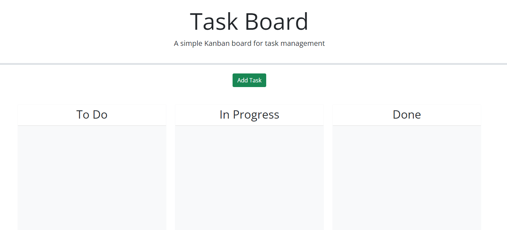
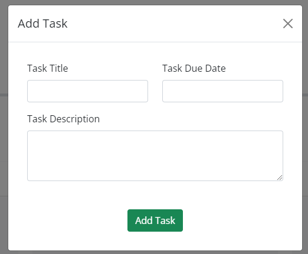
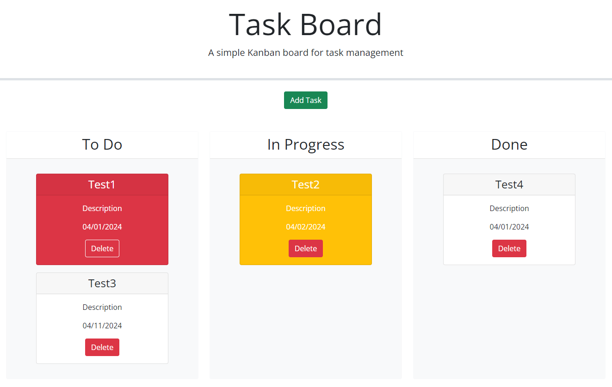
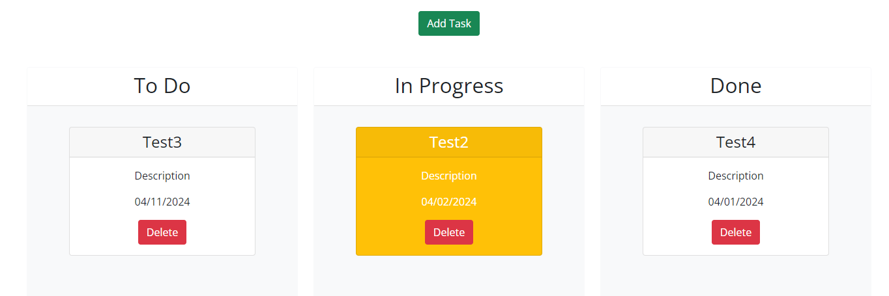

# Task Board

## Description

Task Board is a simple Kanban board for task management. It allows users to add, track, and organize tasks across different stages of completion.

## Features

- **Add Task**: Users can easily add new tasks using the provided form.

- **Drag and Drop**: Tasks can be moved between different status lanes (e.g., To Do, In Progress, Done) by dragging and dropping them.
- **Due Date Highlighting**: Tasks with due dates are visually highlighted based on their status and proximity to the due date.

- **Task Deletion**: Users can delete tasks they no longer need.

## Technologies Used

- HTML5
- CSS3
- JavaScript
- Bootstrap
- jQuery UI
- Day.js (for date manipulation)

## Installation

1. Clone this repository to your local machine.
2. Open the `index.html` file in your web browser.

## Usage

- To add a new task, click the "Add Task" button and fill out the form fields in the modal.
- Tasks can be moved between different status lanes by dragging and dropping them.
- Tasks with due dates are automatically highlighted based on their status and proximity to the due date.
- To delete a task, click the "Delete" button on the task card.

## Contributing

Contributions are welcome! If you'd like to contribute to this project, please fork the repository, make your changes, and submit a pull request with your proposed changes.

## License

This project is licensed under the [MIT License](LICENSE).

## Acknowledgments

- Special thanks to [UC Berkeley Coding Bootcamp](https://bootcamp.berkeley.edu/coding/) for providing the resources and support to help me kickstart my coding journey.